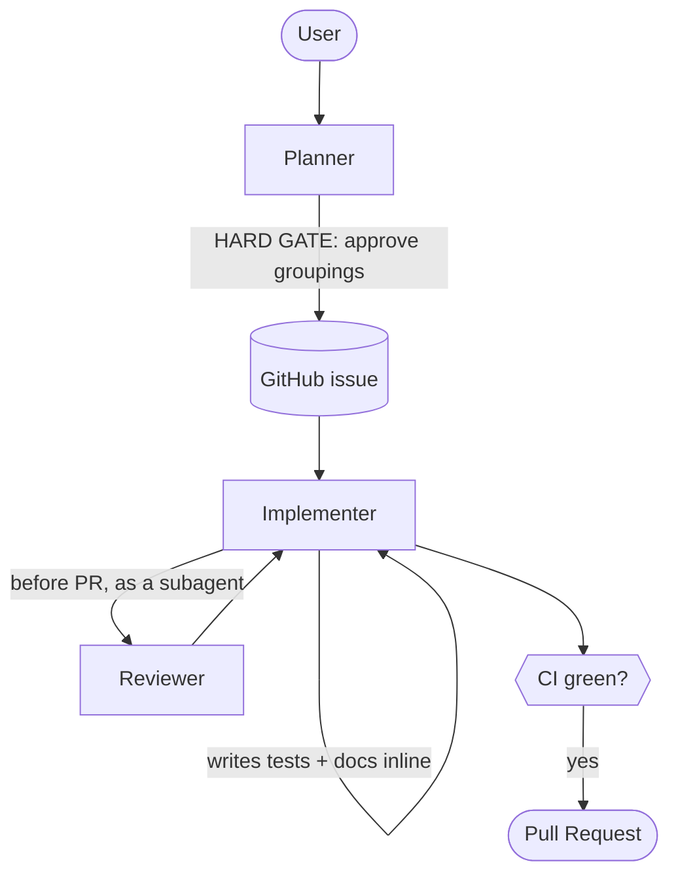

# Agent Setup

A small set of specialized AI agents that turn a feature idea into reviewed, tested,
documented, shipped code. Deliberately kept to **three** — a team should be able to
instinctively know which one to reach for, without a roster to memorize. Every agent
definition lives in [`agents/`](agents/) and is fully generic (no `{{PLACEHOLDER}}`
tokens): it's installed **globally**, once per machine, via
`node plugin/scripts/install.mjs` (the same mechanism as the kit's skills) — not copied
into each repo.

## Why three, not more

Splitting implementation, planning, and review into separate agents keeps each one's
context and responsibility narrow. But every extra agent is also something a whole team
has to learn, remember, and actually use — and a role that just restates an existing
`AGENTS.md` invariant ("write tests", "update docs") isn't a new responsibility, it's
duplication. Tests-with-behaviour and docs-updated-in-the-same-change are already
non-negotiable rules every agent follows; **Implementer** does them itself instead of
delegating to a separate TestWriter/DocUpdater agent. A separate `Security` agent added
nothing either — its pipeline-time OWASP checklist now lives directly in **Reviewer**.

## The roster

| Agent           | Role                                                                                          | Invocable        | Model (suggested)              |
| --------------- | ----------------------------------------------------------------------------------------------| ---------------- | ------------------------------- |
| **Planner**     | Challenges a feature idea, produces requirements, groups into stories, writes/refines the GitHub issue(s). | user  | Opus-class (deepest reasoning) |
| **Implementer** | Implements a GitHub issue, or a plain ad hoc description when no issue exists — writes its own tests, updates its own docs, runs the pre-PR review, opens the PR. | user | Sonnet-class |
| **Reviewer**    | Pre-PR self-review (security, clean code, risk, AC coverage, tests); read-only, reports.       | user + subagent  | Sonnet-class                    |
| **Explore**     | Read-only codebase exploration; safe to run in parallel. Copilot only — Claude Code ships an equivalent built in, so there's nothing to install there. | subagent only | Sonnet-class |

## A note on Claude Code specifically

Claude Code has no `/`-invocable subagent mechanism — slash commands only exist on
Skills. So on the Claude side, all three agents are installed as **skills**
(`/planner`, `/implementer`, `/reviewer`) that run inline in your current session, never
forked into a delegated subagent. Planner and Implementer need this because Claude Code
strips the `AskUserQuestion` tool from every delegated subagent, foreground or
background, and both need to ask clarifying questions. Reviewer never needs to ask
anything, so it could have forked into a dedicated, tool-restricted subagent for a real
(not just instructed) read-only guarantee — but that was tried and reverted: VS Code's
Copilot also auto-detects `.claude/agents/*.md` files as custom agents, with no
frontmatter field to hide one from its picker, so the dedicated subagent always showed up
as a confusing second "Reviewer" entry there. Not worth it for one enforcement edge case
against an already-explicit "don't edit" instruction — Reviewer's read-only contract on
Claude is instruction-enforced, same as Planner and Implementer.

## The pipelines

### Story-driven development (primary)



1. **Planner** challenges the idea, produces a numbered requirements list, and — after
   the user approves the story groupings (a hard gate) — writes each as a GitHub issue.
2. **Implementer** takes an issue number (or, with no issue, challenges the request
   itself and defines its own requirements/acceptance criteria first — see below),
   branches, implements strictly in scope, and verifies each acceptance criterion with
   `file:line` evidence.
3. It writes its own tests and updates its own docs as required steps — not delegated to
   a separate agent, since both are already `AGENTS.md` invariants.
4. Before opening the PR, it dispatches **Reviewer** on the full diff (security, clean
   code, risk, acceptance-criteria coverage, tests). Reviewer is read-only: it reports
   Must-fix / Should-fix / Consider findings, which the Implementer resolves (writing any
   needed regression test itself) before proceeding.
5. After CI is green, it commits, pushes, and opens a PR.

### Ad hoc (no issue)

Given a plain description instead of an issue number, **Implementer** first challenges
the request and defines its own requirements/acceptance criteria (user confirms), then
follows the same pipeline as above, and optionally creates a retrospective closed issue
for traceability.

### Standalone use

- `User → Reviewer` — self-review a working diff before opening a PR; complements
  GitHub's Copilot PR review by running earlier and knowing this repo's own rules.
- `Explore` is never user-invoked directly; Planner/Implementer/Reviewer call it to
  gather context without cluttering the main conversation. Claude Code ships an
  equivalent built in, so there's nothing to install there.

## Handoff mechanics

- **`agent` tool** — runtime subagent invocation (Implementer → Reviewer). No
  frontmatter entry needed on the Copilot side.
- **Claude side** — all three run as inline skills, not subagents (see above); Implementer
  invokes Reviewer by asking the user to run `/reviewer`, since a skill can't dispatch
  another skill as a subagent the way Copilot's `agent` tool can.

## The universal convention

Every interactive agent must follow the agent-authoring convention (see
`../02-agentic-preparation/templates/instructions/agents.instructions.md`):

- The **ask-questions tool** is in the `tools:` frontmatter.
- An **Interaction Mode** section forbids plain-text questions and requires batching all
  questions into one call, with a recommendation on each.

This is enforced for `*.agent.md` files by the `applyTo` glob so no agent can be authored
without it. Because Claude Code strips `AskUserQuestion` from every delegated subagent,
Planner and Implementer must always run as the main session persona (invoked directly by
the user), never dispatched by another agent — that's what keeps their ask-questions
capability intact regardless of harness.

## Anti-rationalization guardrails

Implementer and Planner carry a "Red Flags" table that names the excuses agents use to
expand scope or skip verification ("this small refactor is related", "I'm confident this
works", "just this once") and rebuts each. Verification hard-gates require pasting
**actual command output** — "tests pass" without output is treated as a failure to
verify.

## Install

Agents are fully generic — no `{{PLACEHOLDER}}` tokens — and installed globally, once per
machine, the same way as this kit's skills:

```
node plugin/scripts/install.mjs
```

This copies `Planner.agent.md`, `Implementer.agent.md`, `Reviewer.agent.md`, and
`Explore.agent.md` into `~/.copilot/agents/`, and installs the Claude-side equivalents
(`/planner`, `/implementer`, `/reviewer` skills) into `~/.claude/skills/`. There is no
per-repo copy step — re-run the installer after a `git pull` to pick up any kit update,
everywhere at once.

- [ ] Confirm your tool's ask-questions tool name matches the `tools:` frontmatter.
- [ ] Copy `workflows/security-scan.yml` and `workflows/ci.yml` → `.github/workflows/`.
- [ ] Add `.trivyignore` (allowlist) and a decision-records doc for accepted CVEs.
- [ ] Make CI and the security gate **required status checks** in branch protection.
- [ ] Verify Planner/Implementer/Reviewer appear in your tool's agent picker (Copilot) or
      via `/planner` `/implementer` `/reviewer` (Claude).
